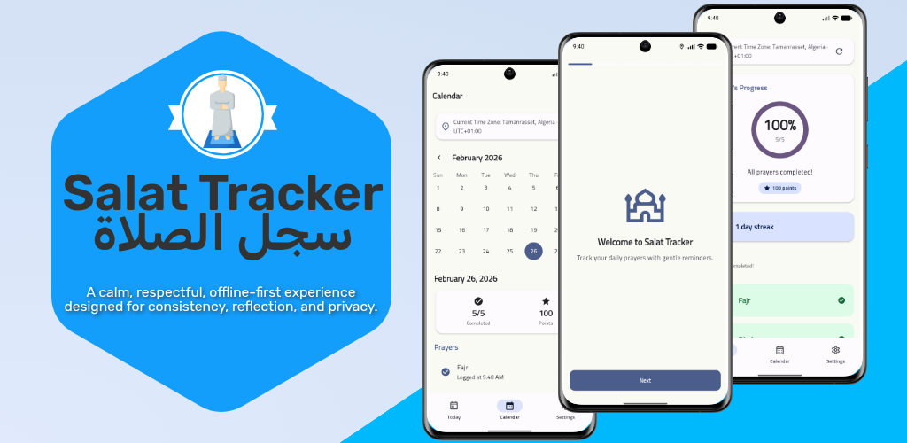

<div align="center">
  
  <br><br>
  <h1>سجل الصلاة<br>Salat Tracker</h1>
  <p><strong>A calm, respectful, offline-first experience designed for consistency, reflection, and privacy.</strong></p>
  <p>
    <a href="#features">Features</a> •
    <a href="#philosophy">Philosophy</a> •
    <a href="#privacy">Privacy</a> •
    <a href="#developers">For Developers</a>
  </p>
</div>

<br>

Salat Tracker is an **Arabic-first** application (with full English and French support) that helps users log their daily prayers, review their progress over time, and receive supportive environmental reminders—**all without pressure mechanics or manipulation.**

## 🕊️ Philosophy
Unlike modern habit trackers that rely on psychological anxiety or "shame language," Salat Tracker operates strictly on the principles of **intrinsic motivation and respect**.
* **Progress over Streaks:** Your daily completion percentage is the primary metric. Streaks are tracked, but never punished.
* **Reflective Gamification:** We provide supportive milestones and points, but there are no leaderboards and no manipulative notification loops.
* **Calm Interface:** Powered by Material Design 3 and Dynamic Color (Material You), ensuring a serene integration with your device's native aesthetics.

## ✨ Core Features
* **Today Dashboard:** A one-tap checklist for the five daily prayers (`Fajr`, `Dhuhr`, `Asr`, `Maghrib`, `Isha`), complete with a beautiful, animated progress ring and supportive contextual notes.
* **Calendar Reflection:** A comprehensive monthly overview highlighting your consistency. Supports retrospective day-editing.
* **Smart Reminders:** Completely customizable notification offsets for each prayer, plus a supportive end-of-day reflection reminder, automatically synchronized with your local timezone coordinates.
* **Premium UX:** Highly polished touch interactions including tactile micro-animations on cards, slick bottom navigation, and native Material 3 dialogs.

## 📱 Screenshots

<div align="center">
  <table>
    <tr>
      <td></td>
      <td></td>
      <td></td>
    </tr>
    <tr>
      <td align="center"><b>Today Dashboard</b></td>
      <td align="center"><b>Calendar History</b></td>
      <td align="center"><b>Settings</b></td>
    </tr>
  </table>
  <br>
  <table>
    <tr>
      <td></td>
      <td></td>
      <td></td>
    </tr>
    <tr>
      <td align="center"><b>Serene Onboarding</b></td>
      <td align="center"><b>Arabic (RTL) Calendar</b></td>
      <td align="center"><b>Arabic Dashboard</b></td>
    </tr>
  </table>
</div>

## 🔒 Privacy & Architecture
* **Offline-First:** Your data is yours. The core experience operates entirely offline using internal resilient storage.
* **Lock & Key:** Contains built-in App Lock (PIN and Biometric Unlock) to ensure your prayer history remains completely private, locking immediately upon device screen-off.
* **No Telemetry:** We utilize `sentry` for strict crash reporting (if you opt-in), but all logs are completely PII-scrubbed. No behavioral tracking.

## 🚀 Planned Features / Roadmap
While the core offline tracker is complete and production-ready, we have several exciting features planned for future releases:
* **Home Screen Widgets**: Instantly view the next prayer time and your daily progress without opening the app.
* **Cloud Sync & Backup**: Secure, opt-in cloud synchronization (via Firebase/Supabase) to restore your authentic prayer history across devices.
* **Qibla Compass**: A beautiful, minimalist Qibla direction finder integrated smoothly into the core application.

---

## 💻 For Developers & Contributors
This repository contains a full production-grade Flutter application adhering to strict Clean Architecture boundaries and high-tier Material 3 design tokens.

### **Quick Start:**

1. Ensure the Flutter SDK (`>=3.10.7`) is installed and run `flutter doctor`.
2. Install dependencies: `flutter pub get`.
3. Generate models and localization: `dart run build_runner build` and `flutter pub run intl_utils:generate`.
4. Run the app: `flutter run`
   *(Optional)* For local development secrets, create a `config.json` file in the root directory:
   ```json
   {
     "SENTRY_DSN": "your_dsn_here",
     "SENTRY_ENV": "development"
   }
   ```
   Launch via: `flutter run --dart-define-from-file=config.json`

### Technical Foundation
* **State Management:** Riverpod 3 + code generation.
* **Persistence:** Hive CE for high-speed local data.
* **Localization:** Fully integrated `intl` + `flutter_localizations` with enforced AR/EN/FR parity.
* **Navigation:** Type-safe routing via `go_router`.

### Engineering Documentation
For full architectural details, requirements, and design specifications, refer to the `docs/` hub:
- 📖 [Delivery Plan](docs/plan.md)
- ✅ [Execution Tasks](docs/tasks.md)
- 🎨 [Design System](docs/design-system.md)
- 🧠 [UX & Gamification Psychology](docs/ux-gamification-psychology.md)
- 📜 [Engineering Rules](docs/rules.md)

---

## 📬 Contact & Support
For feedback, issues, or suggestions, please contact:
**[douadi.med.abderraouf@gmail.com](mailto:douadi.med.abderraouf@gmail.com)**
