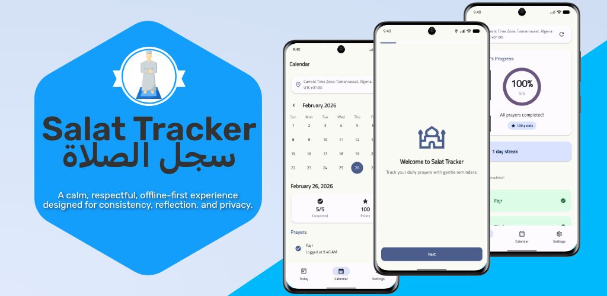

  
    
  <h1>سجل الصلاة Salat Tracker</h1>
  
<strong>A calm, respectful, offline-first experience designed for consistency, reflection, and privacy.</strong>

  

    <a href="#core-features">Features</a> •
    <a href="#philosophy">Philosophy</a> •
    <a href="#privacy--trust">Privacy</a> •
    <a href="#screenshots">Screenshots</a>
  

 

Salat Tracker is an Arabic-first app (with full English and French support) that helps you log daily prayers, review your consistency over time, and stay supported with respectful reminders.

## Philosophy

Salat Tracker is designed around intrinsic motivation, not pressure.

- Progress over shame: completion is primary, streaks are secondary context
- Reflective gamification: no leaderboards, no manipulation loops
- Calm interface: clear, readable, respectful visual language

## Core Features

- Today dashboard: one-tap logging for Fajr, Dhuhr, Asr, Maghrib, Isha
- Calendar reflection: monthly consistency view with safe history edits
- Smart reminders:
  - per-prayer notification offsets
  - configurable daily reminders list (time + enabled)
  - notification entry actions (Mark as done, Snooze 10 min)
- Security: app lock with PIN and biometric unlock
- Updates: Settings-first in-app updates with channel-aware behavior
- Localization: Arabic (RTL), English, French

## Screenshots

  <table>
    <tr>
      <td></td>
      <td></td>
      <td></td>
    </tr>
    <tr>
      <td align="center"><b>Today Dashboard</b></td>
      <td align="center"><b>Calendar History</b></td>
      <td align="center"><b>Settings</b></td>
    </tr>
  </table>
   
  <table>
    <tr>
      <td></td>
      <td></td>
      <td></td>
    </tr>
    <tr>
      <td align="center"><b>Onboarding</b></td>
      <td align="center"><b>Arabic Calendar (RTL)</b></td>
      <td align="center"><b>Arabic Today (RTL)</b></td>
    </tr>
  </table>

## Privacy & Trust

- Offline-first core flows
- Local data persistence
- PII-safe crash reporting policy
- No behavior-tracking telemetry loops

## Roadmap

- Home screen widgets
- Opt-in cloud backup/sync
- Qibla compass

## Developer Docs

If you are contributing, use the docs hub in `docs/`:

- `docs/README.md` (index)
- `docs/prd.md` (requirements)
- `docs/plan.md` (delivery plan)
- `docs/tasks.md` (execution checklist)

## Version

- App version: `0.1.7+9`

## Contact

For feedback and support:
`douadi.med.abderraouf@gmail.com`
